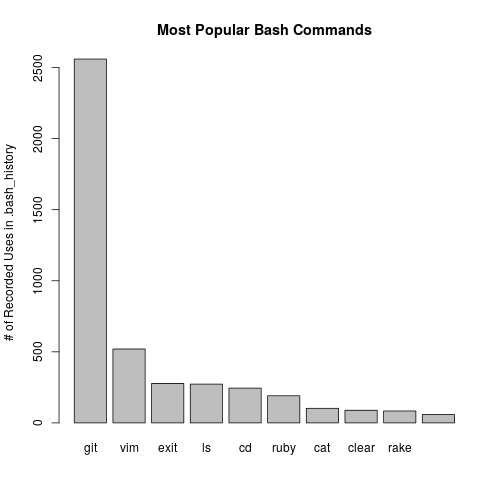

# History
Tracking & Graphing my Bash History

## Usage

`save.sh` moves my `~/.bash_history` into the `data/` directory. `analyze.rb` crunches the numbers and spits out a `results.json` file. Eventually, `graph.r` will plot the data.

## Visualization Ideas

- Top ~10 Commands
- Total Commands per Week (over time)
- Each of Top 10 Commands per Week

## Results

Obviously, I'm not going to commit the `data/` directory with all of my bash history, nor will I commit the `results.json` file. However, here is a nice picture:

