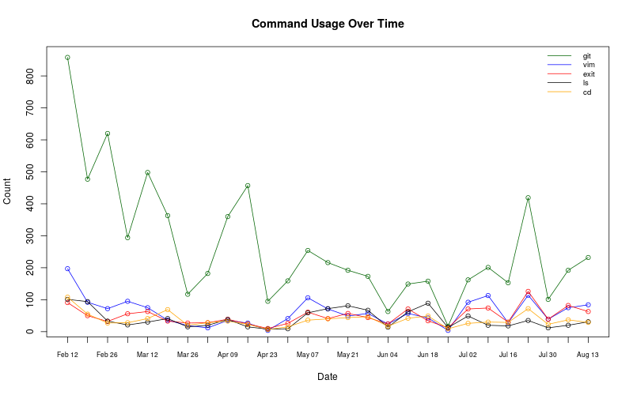

# History
Tracking & Graphing my Bash History



## Requirements

- Bash (duh)
- Ruby (>= 2.3.3)
- R (>= 3.3.3)

## Setup

### Bash History

I customized a few of my `.bashrc` configs to work better with this:

```
# Don't store lines starting with space in the history.
HISTCONTROL=ignorespace

# Append to the history file, don't overwrite it.
shopt -s histappend

# Sizes for the .bash_history file.
HISTSIZE=5000
HISTFILESIZE=25000
```

### Cron job

To make things easier, I set up a cron job to automatically run the `save.sh` script periodically (in my case, once every hour). The crontab entry looks like:

```
0 * * * * /path/to/directory/save.sh
```

> **NOTE:** You must add the crontab entry to *your user's* crontab (such as by running `crontab -e`), as the save script relies on `$HOME` being set to your home directory.

## Usage

- `status.sh` gives you the current number of unsaved lines in the `~/.bash_history` file
- `save.sh` moves the `~/.bash_history` file into the `data/` directory with the current timestamp
- `analyze.rb` parses all of the saved files, lists your most popular commands, and spits out the JSON files containing the results
- `top.r` and `times.r` visually display the JSON files
